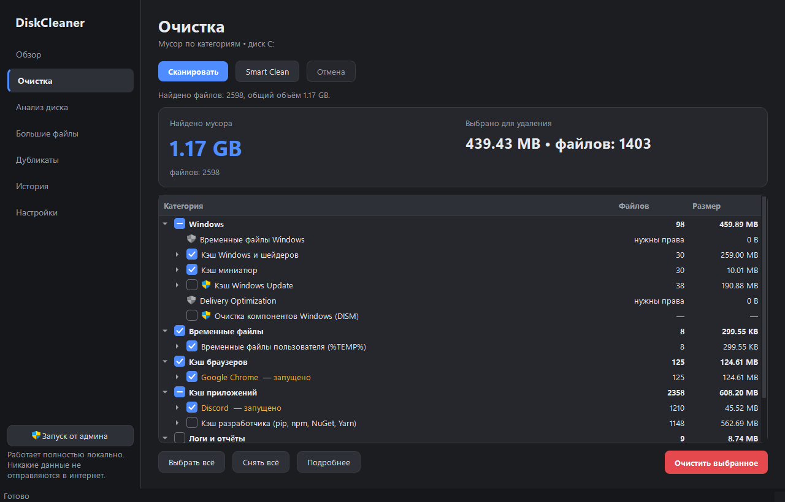
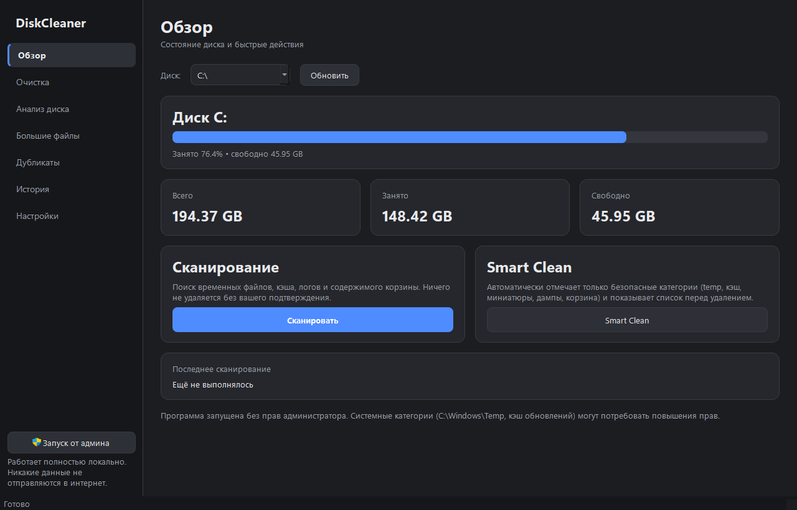
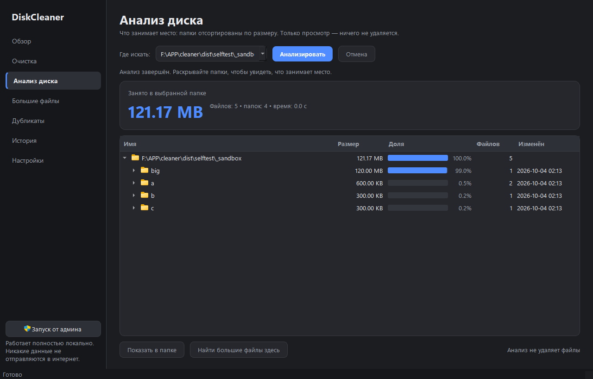
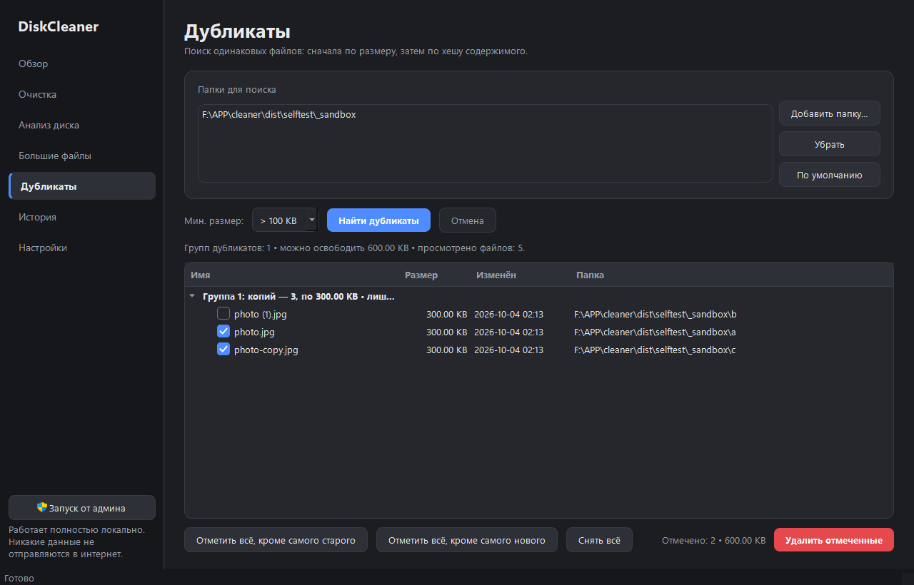
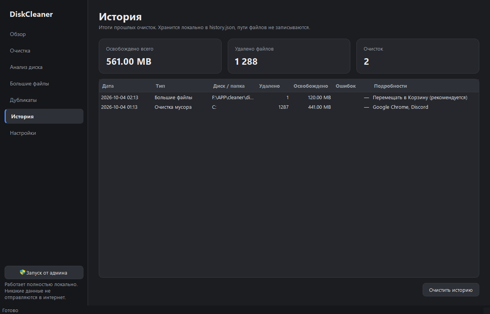
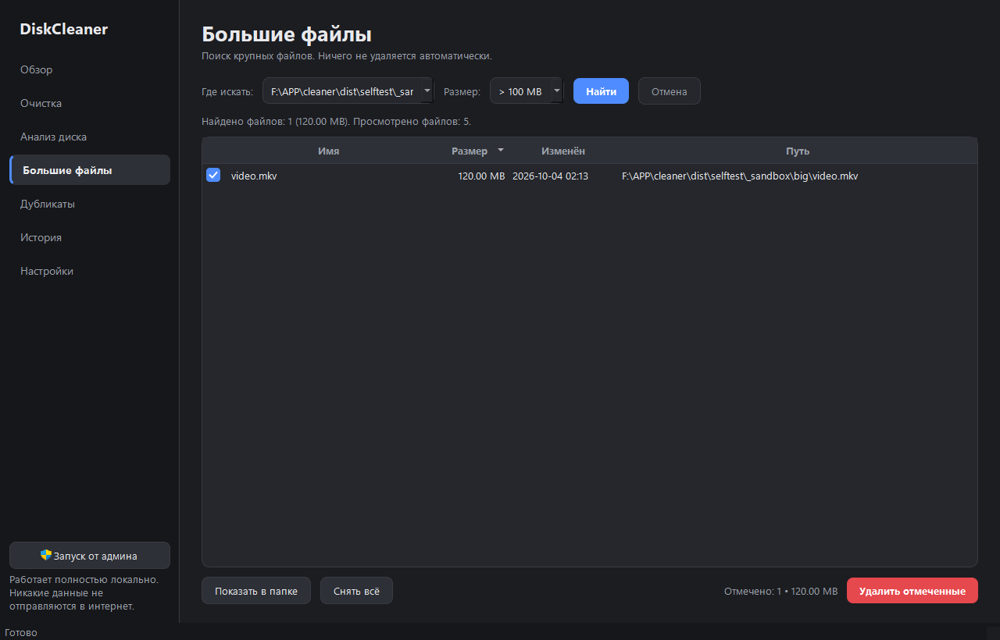
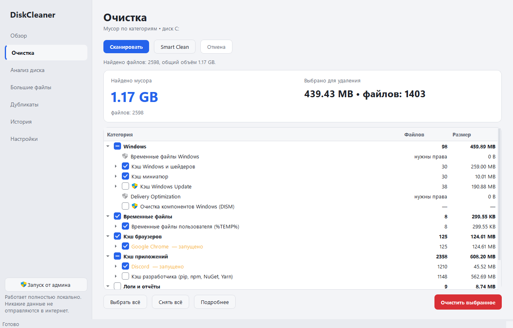
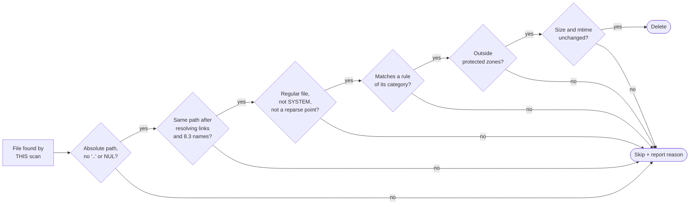

<div align="center">


# Smart Disk Cleaner

**A safe, fully offline disk cleaner for Windows 10/11 — built with Python 3.12 and PySide6.**

It never deletes anything without your explicit confirmation, and every file passes a whitelist-based safety check before removal.

[](https://github.com/vygaslav03/SmartDiskCleaner/actions/workflows/ci.yml)
[](https://github.com/vygaslav03/SmartDiskCleaner/releases/latest)

-41CD52?logo=qt&logoColor=white)


[**Download .exe**](https://github.com/vygaslav03/SmartDiskCleaner/releases/latest) ·
[Features](#features) ·
[Safety model](#safety-model) ·
[Build from source](#build-from-source) ·
[Русская версия](README.ru.md)



</div>

---

## Features

| | |
|---|---|
| **Junk cleaner** | Windows & user temp files, Windows/shader caches, thumbnail cache, crash dumps, Windows Update cache, Delivery Optimization, error reports, old logs, Recycle Bin |
| **Browser & app caches** | Chrome, Edge, Brave, Opera/Opera GX, Firefox, Discord, Telegram, Steam, VS Code, Spotify, pip/npm/NuGet/Yarn — **cache folders only**: cookies, passwords, history and sessions are never touched |
| **Smart Clean** | Pre-selects only safe categories and always shows the full list before anything is deleted |
| **Per-file control** | Open *Details* and uncheck individual files you want to keep |
| **Disk analyzer** | Folder tree sorted by size with share bars and the biggest files in each folder (read-only) |
| **Large files** | Finds files over 100 MB … 10 GB; deletion requires a separate confirmation with a checkbox |
| **Duplicates** | Size → partial hash → full BLAKE2b; at least one copy in every group is always kept |
| **Windows tools** | `Windows.old` via built-in Disk Cleanup and component store cleanup via `DISM /StartComponentCleanup` (admin only, never auto-selected) |
| **Running apps check** | Warns if Chrome, Discord, Steam etc. are open — never kills processes for you |
| **Winapp2.ini import** | Optional: hundreds of community rules, filtered through the same safety checks; registry rules are ignored |
| **History** | Local log of every clean-up (no file paths stored) with total space freed |
| **UI** | Dark / light / system theme, Russian / Ukrainian / English; all heavy work runs in background threads |

## Screenshots

| Dashboard | Disk analyzer |
|---|---|
|  |  |
| **Duplicates** | **History** |
|  |  |
| **Large files** | **Light theme** |
|  |  |

## Safety model

The core principle: **whitelist, not blacklist.** A file is deleted only if *every* check passes:



- **Protected zones:** Desktop, Documents, Downloads, Pictures, Videos, Music, OneDrive, Public folders, `System32`, `SysWOW64`, `WinSxS`, `Program Files` (opt-in, known caches only), `System Volume Information` and your own exclusions. Real locations are resolved via `SHGetKnownFolderPath`, so redirected folders are protected too.
- **Rules are validated too:** a rule root can never be a drive root, your profile, AppData as a whole or the Windows folder.
- **Fresh temp files** (younger than 24 h by default) are never touched — installers may be using them — and no other category can pick them up either.
- **Locked, access-denied and too-long paths** are skipped and reported; one failure never stops the operation.
- **Recycle Bin** is emptied via `SHEmptyRecycleBinW`; `Windows.old` and WinSxS are handled by Windows' own tools, not by deleting files.
- **Large files and duplicates** go to the Recycle Bin by default.
- **Privacy:** no telemetry, no network access, no accounts. Logs and history stay on your PC.

## Download

Get `DiskCleaner.exe` from the [latest release](https://github.com/vygaslav03/SmartDiskCleaner/releases/latest) — a single portable file, no Python required.
Settings, logs and history are stored next to the exe (or in `%LOCALAPPDATA%\DiskCleaner` if that folder is read-only).

> Windows SmartScreen may warn about an unsigned app from a new publisher: click *More info → Run anyway*, or build it yourself from source.

## Build from source

```bat
git clone https://github.com/vygaslav03/SmartDiskCleaner.git
cd SmartDiskCleaner
python -m venv .venv
.venv\Scripts\activate
pip install -r requirements.txt -r requirements-dev.txt

python run.py            &:: run the app
python -m pytest         &:: unit tests
selftest.bat            &:: GUI self-test (read-only) -> selftest\report.txt + screenshots
build.bat                &:: tests + PyInstaller -> dist\DiskCleaner.exe
```

## Testing

| Layer | What it covers |
|---|---|
| **Unit tests** — `tests/`, 126 | safety policy, path traversal, symlink/junction escapes, files changed after scan, scanner rules, cleaner, duplicates, analyzer, Windows tools (mocked), history, Winapp2 import |
| **GUI self-test** — `--selftest` | opens every page in both themes, runs real **read-only** scans, checks UI invariants, saves screenshots; all delete functions are blocked |
| **CI** — GitHub Actions, `windows-latest` | unit tests → GUI self-test (offscreen) → build `DiskCleaner.exe` → artifacts; a `v*` tag publishes a release |

Destructive tests run only inside temporary folders — never on real system directories.

## Project structure

```
app/
  core/      safety · categories · scanner · cleaner · recycle_bin
             disk_analyzer · space_analyzer · duplicate_finder
             system_cleanup · processes · history · winapp2
  ui/        main_window · dashboard · cleaner · analyzer · large_files
             duplicates · history · settings · widgets · workers · theme
  models/    file_item · scan_result
  utils/     winpaths · permissions · settings_store · i18n · logger · paths
tests/       unit tests
.github/     CI workflow
```

## Known limitations

- Files locked by running programs are skipped — close them first (the app tells you which).
- System categories (`C:\Windows\Temp`, Windows Update, DISM) need administrator rights.
- The disk analyzer walks the file system (about 20–60 s for 500k files); it does not read the NTFS MFT directly yet.
- The space freed by DISM is known only after it finishes.

## License

[MIT](LICENSE) © 2026 Vladyslav Vygovskiy. Winapp2.ini is **not** bundled — it is a separate community project with its own license.
